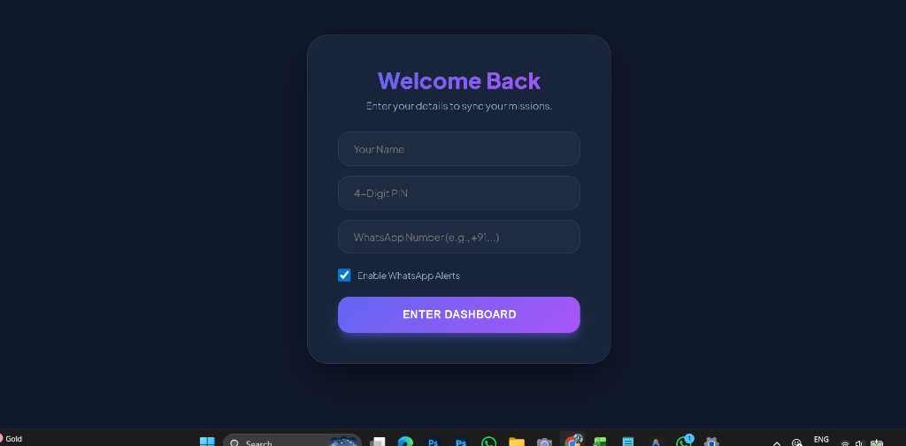
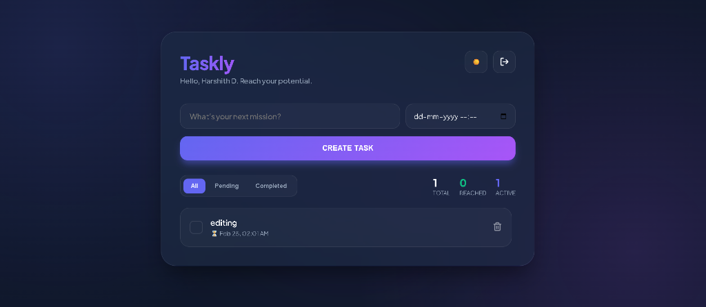
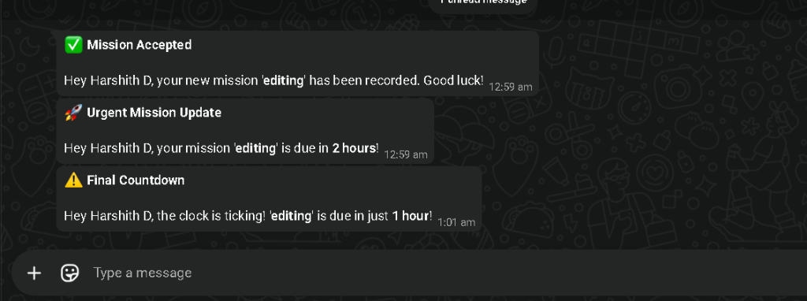

# 🚀 Taskly | Master Your Missions

**Taskly** is a premium, multi-user Task Management Web Application designed for high-performance individuals. It combines a stunning "Glassmorphism v2" aesthetic with real-time WhatsApp notifications to ensure you never miss a deadline.

## ✨ Key Features

- **🔐 Smart Authentication**: Register or login instantly with just your Name and a 4-digit PIN. Each user has a private, persistent mission list.
- **📱 Personalized WhatsApp Alerts**:
    - **Instant Confirmation**: Receive a WhatsApp message the moment a new task is created.
    - **Urgent Reminders**: Automatic notifications sent 2 hours and 1 hour before a deadline.
- **💎 Premium UI/UX**:
    - **Glassmorphism v2**: Modern blurred mesh backgrounds and floating glass cards.
    - **Micro-Animations**: Smooth transitions, card entry effects, and custom checkboxes.
    - **Confetti Feedback**: Celebrate every mission completed with high-energy visuals.
- **🌙 Dynamic Appearance**: Seamlessly toggle between Light and Dark modes with a single click.
- **📅 Precise Deadlines**: Integrated `datetime-local` picker for exact mission scheduling.

## 📸 Project Demo

````carousel

Login or register instantly with a beautiful glassmorphic interface and WhatsApp alert toggle.
<!-- slide -->

Track your missions with real-time counters, filters, and motivational glassmorphism.
<!-- slide -->

Stay proactive with automated WhatsApp reminders for task creation and upcoming deadlines.
````

## 🛠️ Tech Stack

- **Frontend**: Vanilla HTML5, CSS3 (Custom Variables & Animations), JavaScript (ES6+), Canvas Confetti.
- **Backend**: Python (Flask), Flask-CORS.
- **Database**: PostgreSQL (NeonDB) with `psycopg2`.
- **Notifications**: Twilio WhatsApp API.
- **Automation**: APScheduler (for background notification monitoring).

## 🚀 Setup & Installation

### 1. Requirements
- Python 3.x
- PostgreSQL Database (e.g., NeonDB)
- Twilio Account (for WhatsApp alerts)

### 2. Environment Variables
Create a `.env` file in the root directory:
```env
DATABASE_URL=your_postgres_url
PORT=3000
TWILIO_ACCOUNT_SID=your_sid
TWILIO_AUTH_TOKEN=your_token
TWILIO_WHATSAPP_NUMBER=whatsapp:+14155238886 (Twilio Sandbox)
```

### 3. Installation
```bash
pip install -r requirements.txt
python app.py
```

### 4. Open in Browser
Visit `http://localhost:3000` to start mastering your missions.

## 📝 License
Proprietary. All rights reserved.
